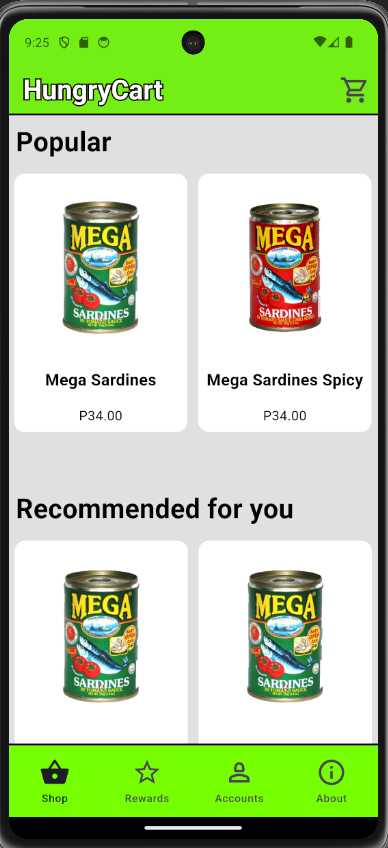
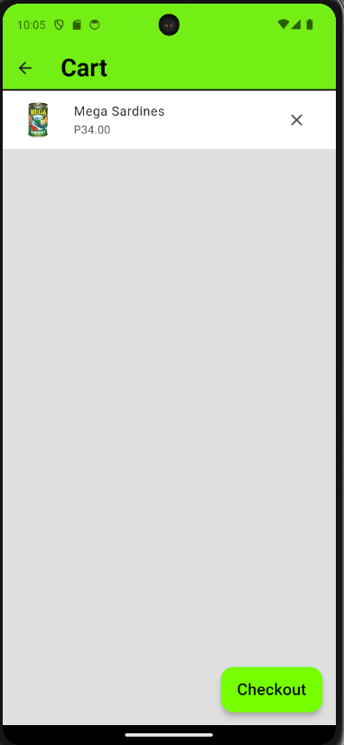
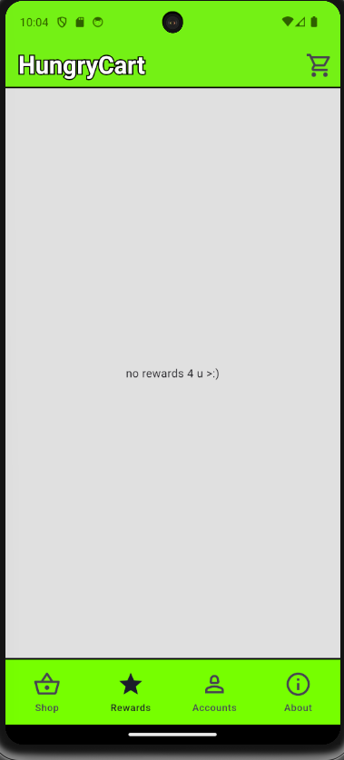
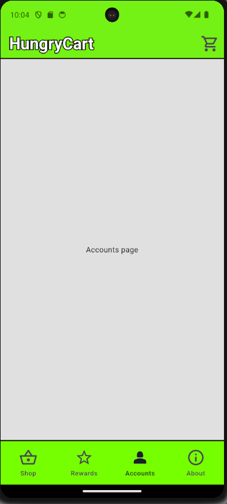
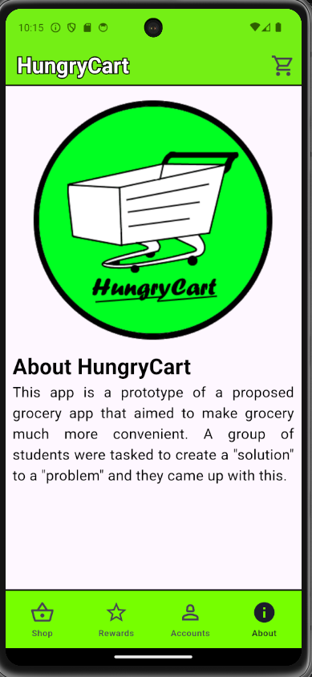

# HungryCart

This app is a prototype of a proposed grocery app that aimed to make buying groceries much more convenient. A group of students were tasked to create a "solution" to a "problem" and they came up with this.\
\
What works:
- Adding/removing items to/from the cart.
- Navigating between tabs/destinations.
- "Buying" the items via checkout (though it doesn't really do anything other than clear the cart)

TBA:
- Splash screen
- Accounts (Login/logout) (may or may not do this one)
- Rewards (also may or may not do this)

## Some screenshots
\
Please ignore the abundance of sardines. Those are just placeholder data :>

